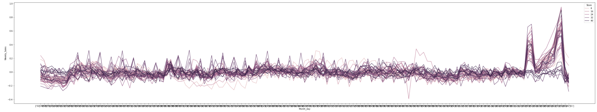

# Retail Prediction in the United States
​
University of California, Berkeley Extension Data Analytics Bootcamp Final Project
​
---
​
### Group Members:
​
| Member               	| Role 	                 | Responsibilities                                                 |
|----------------------	|---------------------   | -------------                                                    |
| [Rob Bonovich](https://github.com/rbobo22)|  Project Manager and Dashboard Lead    	 |  Manage the Project, Presentation, Dashboard, Technology, and GitHub Repo   |
| [Nuphar Ezra](https://github.com/nupharezra)    	|  Machine Learning Lead         |  Manage the Machine Learning Model and Design                             |
| [Michael Mishkanian](https://github.com/Mishkanian)       	|  Dashboard Lead |  Manage the Database and ETL Process 	                |
​
Although specific roles are assigned, all members collaborate and work together on each part of the project. 
​
**Communication Protocols:** Team members communicate using Slack messaging and Zoom video calls.
​
---
​
## Project Topic
We have chosen to analyze the Retail market in the United States because we have a professsional interest in retail sales.
​
Our goal for this project is to predict future sales in an effort to be as efficient as possible in our store operations. 
​
## Questions to Answer
Using the data we have gathered, we hope to answer the following questions:
​
1. How does disposable income on a macroeconomic level affect future sales at our stores?
​
2. How does inflation affect sales on a macroeconomic level.
​
## Technologies and Tools
The following technologies and tools are used in this project.
​
**Languages:**
- Python 3.7
- SQL
- JavaScript
- HTML
- CSS
​
**Software:**
- Pandas
- matplotlib
- scikit-learn
​
**Tools:**
- Jupyter Notebook
- GitHub
- AWS S3
- PostgreSQL / pdAdmin4
- Tableau
​
## Data Sources
​
[Kaggle: Retail Data Analytics - Features](https://www.kaggle.com/manjeetsingh/retaildataset?select=Features+data+set.csv)
Description: The Retail Data Analytics dataset contains historical sales data of 45 Walmarts located in different regions of the United States. Anonymized information is provided about the type and size of store.
​
[Kaggle: Retail Data Analytics - Stores](https://www.kaggle.com/manjeetsingh/retaildataset?select=Features+data+set.csv)
Description: The Stores sheet contains data related to Walmart stores, department number, and regional activity.
​
[Kaggle: Retail Data Analytics - Sales](https://www.kaggle.com/manjeetsingh/retaildataset?select=Features+data+set.csv)
Description: The Sales sheet contains data on Weekly Sales by each Walmart store, department number, and date.
​
## ETL Process
​
After gathering the data from Kaggle, we began to transform and clean the datasets. This process started by reading in CSV files as DataFrames and checking for null values and missing data. The data is then plotted using **matplotlib** to catch potential outliers. Due to the small sample size, we opted not to delete any rows. To counteract this sample size issue, we will use several different methods to oversample the data in our Machine Learning model later in the project. Prior to loading the data to a database, it was necessary to transform the date columns of the sheets to match each other. This is done using the Python **datetime** module. We chose to use a MM/DD/YYYY format because of its popular use in the United States.
​
## Database
​
The cleaned datasets are loaded to tables in pgAdmin according to the Entity Relationship Diagram (ERD) we created. Our ERD generation tool of choice is [quickdatabasediagrams.com](https://www.quickdatabasediagrams.com/). A full left join is performed on the date column using the 'Features' table and each of the other tables. After joining all of the tables, the final table is exported as a new CSV file.
​

​
## Machine Learning

#### Provisional Model

Our provisional model used to identify trends within the data was a Linear Regression model, where collected the mean weekly sales across the years for each store independently. See graph below. As you can see, there are two large spikes in sales towards the end of the year across all stores, 
 Later in this project, we will test and compare the performance of other techniques to create a more optimized model.

#### Updated Model

After multiple trials, we have decided to use a Random Forest Regression Model. We have chosen to use this model because it is robust to outliers, works well on non-linear data, and estimates of what variables that are important in the classification. It should be recognized that a limitation of Random Forest Regressors is the tend to overfit for some datasets with noisy classification/regression tasks. The data is split into test and training by a ratio of 30:70. For the features, we chose to use the new features from the FRED data and as our target we selected weekly sales.

